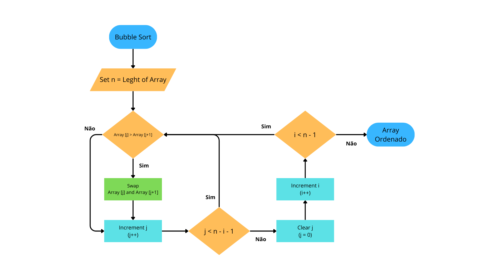

### Código de Teste: Bubble Sort

O **Bubble Sort** é um algoritmo de ordenação simples que percorre repetidamente a lista, compara elementos adjacentes e os troca se estiverem na ordem errada, movendo gradualmente os elementos não ordenados para seus lugares finais. Esta aplicação foi desenvolvida para testar o simulador de CPU Python desenvolvido por Renato e verificar a identificação e implementação de instruções que não estão contempladas para execução do programa.

Ao executar o código em conjunto com o disassembler, foi possível identificar as seguintes instruções:
- **Instruções que já existem no Simulador:** `RESUME`, `LOAD_FAST`, `STORE_FAST`, `BINARY_OP`, `LOAD_CONST`, `COMPARE_OP`, `POP_JUMP_IF_TRUE`, `JUMP_BACKWARD`, `SWAP`, `END_FOR`, `RETURN_CONST`

- **Instruções que estão faltando para Implementação:** `CALL`, `LOAD_GLOBAL`, `GET_ITER`, `FOR_ITER`, `BINARY_SUBSCR`, `STORE_SUBSCR`

Para visualizar melhor como essas instruções são implementadas, aqui está uma representação visual do funcionamento do Bubble Sort:

